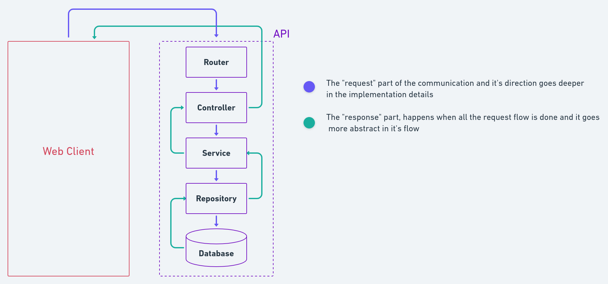

# REST API

## Summary

- Project Archtecture
- Design Patterns
- Application flow
- Routes
- Libraries

## Project Archtecture

This project differs from the classic mvc pattern and includes more divisions
that in it`s turn, are more specific

    |- src    # here goes the whole development code
        |--- controllers        # responsible for recieving the request and returning the response
        |--- database           # contains database specifications
            |--- entities       # classes that represents the "shape" of the database stored data
            |--- migrations     # contains the database "version control" files
            |--- index.ts       # database connection

        |--- errors             # contain the custom error classes
        |--- repositories       # responsible for interacting directly with the database details
        |--- services           # responsible for all the business rule of the application
        |--- routes             # responsible for defining which classes have to deal with a request
        |--- server.ts          # the entry point of the system

## Design Patterns

Here is possible to find two famous design patterns, which are the service pattern and
the repository pattern.

**Service Pattern**: We create classes the contain all of the business rule involved
on a task, which makes easier to implement new ones or maintain the current rules.
They have only one method (execute) and must not know about any kind of specification
details of other layers.

**Repository Pattern**: We create classes that have the only purpouse of interacting
(store, delete, list, ...) with the database and it's implementation details. Every time we
want to execute some query on our database, we should do it using repositories, so we can
know exactly where to look for an error involving the database or where to include new
similar features.

## Application flow

At each request that is made to the api, this steps are followed



## Routes

### Categories

- #### GET: /categories

response:
```js
[
  {
    "code": 1,
    "description": "Comportamental",
    "created_at": "2020-09-03T16:16:41.499Z",
    "updated_at": "2020-09-03T16:16:41.499Z"
  },
  {
    "code": 2,
    "description": "Programação",
    "created_at": "2020-09-03T16:16:59.469Z",
    "updated_at": "2020-09-03T16:16:59.469Z"
  },
  {
    "code": 3,
    "description": "Qualidade",
    "created_at": "2020-09-04T15:46:35.311Z",
    "updated_at": "2020-09-04T15:46:35.311Z"
  },
  {
    "code": 4,
    "description": "Processos",
    "created_at": "2020-09-04T15:46:48.436Z",
    "updated_at": "2020-09-04T15:46:48.436Z"
  }
]
```

- #### POST: /categories

request body:
```js
{
	"code": 4,
	"description": "Processos"
}
```

respose:
```js
{
  "code": 4,
  "description": "Processos",
  "created_at": "2020-09-04T15:46:48.436Z",
  "updated_at": "2020-09-04T15:46:48.436Z"
}
```

### Courses

- #### GET: /courses?search=

url: **/courses?search=Node**

response:

```js
[
  {
    "id": "f7b1068c-6340-40c4-a19a-7e3bffd66b49",
    "description": "NodeJS crash course",
    "from": "2020-10-15T00:00:00.000Z",
    "to": "2020-10-18T00:00:00.000Z",
    "category_code": 2,
    "students_per_class": 16,
    "created_at": "2020-09-03T19:55:31.303Z",
    "updated_at": "2020-09-03T19:56:36.331Z"
  }
]
```

- #### POST: /courses

request body:
```js
{
  "description": "ReactJS crash course",
  "from": "2020-10-15",
  "to": "2020-10-18",
  "category_code": 2,
  "students_per_class": 10,
}
```

response:

```js
{
  "description": "ReactJS crash course",
  "from": "2020-10-15T00:00:00.000Z",
  "to": "2020-10-18T00:00:00.000Z",
  "category_code": 2,
  "students_per_class": 10,
  "created_at": "2020-09-03T19:55:31.303Z",
  "updated_at": "2020-09-03T19:56:36.331Z"
  }
```

- #### PUT: /courses/:id

url: **/courses/f7b1068c-6340-40c4-a19a-7e3bffd66b49**

request body:
```js
{
  "description": "ReactJS crash course",
  "from": "2020-10-15",
  "to": "2020-10-18",
  "category_code": 2,
  "students_per_class": 15,
}
```

response:

```js
{
  "id": "f7b1068c-6340-40c4-a19a-7e3bffd66b49",
  "description": "ReactJS crash course",
  "from": "2020-10-15T00:00:00.000Z",
  "to": "2020-10-18T00:00:00.000Z",
  "category_code": 2,
  "students_per_class": 15,
  "created_at": "2020-09-03T19:55:31.303Z",
  "updated_at": "2020-09-03T19:56:36.331Z"
  }
```

- #### DELETE: /courses/:id

url: **/courses/f7b1068c-6340-40c4-a19a-7e3bffd66b49**

response: **status 200, no body**
