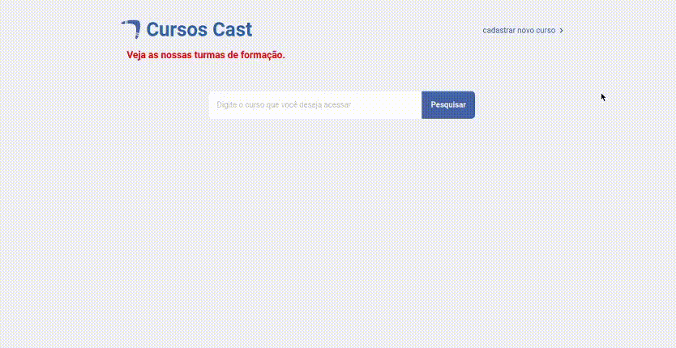
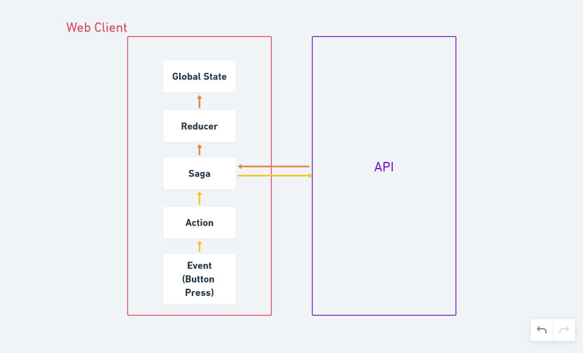

# WEB CLIENT

## Preview



## Summary

- [Project Architecture](#Project-Architecture)
- [Application Flow](#Application-Flow)
- [Technologies](#Technologies)
- [How to run?](#How-to-run)

## Project Architecture

    |- src    # here goes the whole development code
        |--- assets            # contains the global style definition
        |--- components        # small and independent unities of logic, html and css
        |--- pages             # bigger components that contain a whole web page
        |--- Routes            # a component responsible for renderig the pages based on the url
        |--- services          # external services, such as the api connection
        |--- store             # contains the logic of global state management using redux

## Application flow

At each request that is made to the api, this steps are followed



## Technologies

<details>
<summary>ReactJS</summary>
<br>
A JavaScript framework based on components that allows us to create modern, fast
and clean web interfaces.
</details>

<details>
<summary>TypeScript</summary>
<br>
One of the most famous JS supersets. TypeScript allows us to have much more control
of our development environment since we can define interfaces and types for the abstractions
used on our code, so we can know exactly all the params, properties or attributes of such elements.
</details>

<details>
<summary>axios</summary>
<br>
This library is used for creating simple asynchronous http requests on this app.

</details>


<details>
<summary>Redux</summary>
<br>
This is one of the most famous state managers of all React's ecossytem and can be used
to share information between isolated components on a performatic way.

</details>

<details>
<summary>Redux Saga</summary>
<br>
It's a middleware library responsible for making asynchronous tasks, like api calls,
on a redux application
</details>

<details>
<summary>date-fns</summary>
<br>
date-fns is a js library for date-related operations. It has a set of usefull functions
for manipulating Date objects.
</details>

## How to run?

**make sure your backend is running before you run this commands**

```bash
# download the dependencies
yarn

# run the app
yarn start
```

***

<p align=center>
  Made with 💜 and Code by <a href="https://www.linkedin.com/in/lucas-prazeres/">Lucas dos Prazeres</a>
</p>
